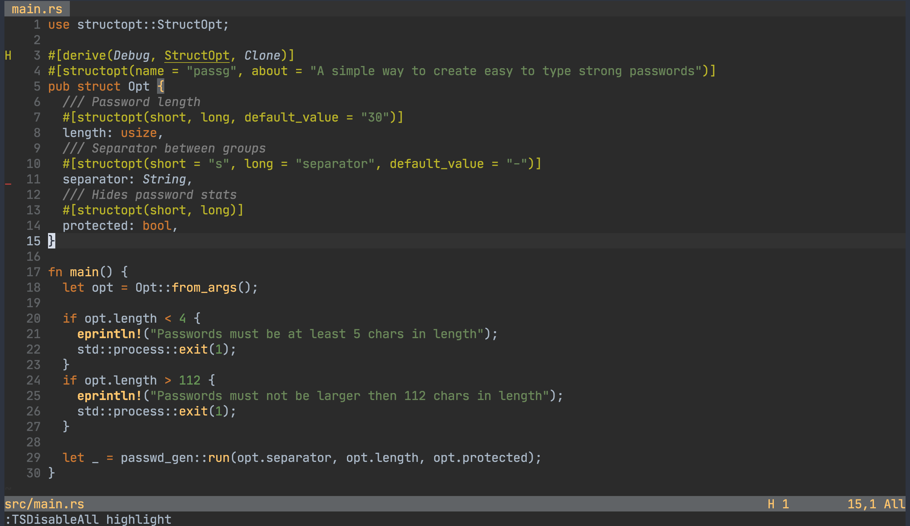

# darcula.vim

[darcula](https://github.com/bulenkov/Darcula) port to vim

## options

### enable italics

`let g:darcula_italic = 1`

### enable italic comments

- must have italics enabled

`let g:darcula_italic_comments = 1`

### disable bold

`let g:darcula_bold = 0`

### underline style

`let g:darcula_underline = 1`
